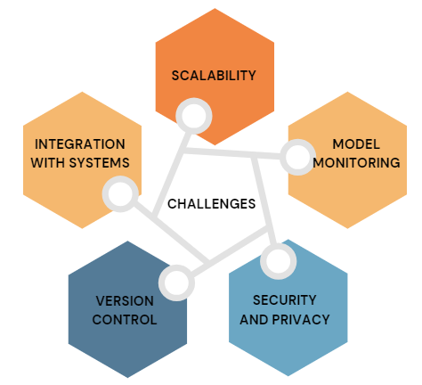

## Predicting Rate of Interest (ROI) from Bureau Data (Hackathon)
**Project Overview:**

As a leading finance firm, encountering data incompleteness is a common challenge that impedes our ability to make conclusive decisions or predictions. One such scenario arises when determining the Rate of Interest (ROI) for an existing loan from a customer taken with an external Financial Institute. However, we do obtain other loan-related details for such tradelines by subscribing to bureaus such as CIBIL and Experian.

The challenge at hand involves using this data to accurately compute or be closest to the actual Rate of Interest (ROI) across various types of loans. Participants are encouraged to leverage mathematical equations in solving this problem while maximizing the available data. The final solution should be robust enough to handle various loan types, including Housing Loan, Property Loan, Business Loan, and Personal Loan.'

**Task:**

We were expected to ideate on a scalable approach to the problem and to build a Machine Learning model, based on the data provided, that predicts the rate of interest(ROI) . 

**Dataset Details**
train_main_loan.csv:  69958 x 24
train_all_loan.csv: 1066009 x 19
test_main_loan.csv: 29983 x 23
test_all_loan.csv: 452990 x 19

The data set consists of financial related data of a customer against a loan & also demographical data belonging to the same individual.

There are multiple files provided.
<ul>
<li>train_main_loan.csv : This will have the main loan on which the participant needs to build the model using the info pertaining to that loan along with Date Of Birth, Gender, Occupation type</li>

<li>test_main_loan.csv: Another file is provided with different set of IDs to validate your model. Once you are able to build model, then you are supposed to get predictions on this dataset using model fit from training dataset. This file would be split between PUBLIC and PRIVATE set on our side. Final evaluation would be done internally on PRIVATE dataset alone.

<li>There are other related files: train_all_loan.csv & test_all_loan.csv of train & test IDs respectively. These files contain customer’s complete credit history including other Live & Closed loans from the past. Participant can use this to extract more credit behavior of the customer and thereby in the model building part.</li>
</ul>

**Steps:**

- **📅 Data Pre-processing and Handling Missing Values:**
    - Handle sparsity of the data using various imputation techniques.
    - Utilize predictive imputation techniques for Repayment Tenure and EMI_amount.
  
- **🎯 Modelling Approach:**
    - Relate EMI, Principal, interest rate, and repayment Tenure using a formula, making them important features for predicting ROI.
    - Utilize tree-based models such as XGBoost, RandomForest, and LGBM to capture nonlinear relationships effectively.
    - Perform Exploratory Data Analysis and Feature Engineering to enhance the predictive power of the ML Model.

- **⚙️ Integration with Systems:**
    - Address challenges to model deployment, including scalability, model monitoring, security, privacy, and version control.

- **📈 Challenges:**
    - Strive for explainability and interpretability of the model despite using ensemble models like XGBoost and RandomForest, which inherently have low interpretability.
    - Explore and implement explainability techniques tailored for ensemble models to gain clearer insights into model behavior.
    - Implement adaptive learning mechanisms for continuous learning from new data and evolving patterns in interest rate dynamics.
    - Identify additional predictive features and refine feature estimation through enhanced domain knowledge to address missing values and improve predictions.
    - Enhance model performance and interpretability through continued exploration of alternative imputation techniques and feature engineering.

By addressing these steps and challenges, the project aims to develop a robust Machine Learning model capable of accurately predicting the Rate of Interest (ROI) from bureau data, thereby aiding in informed decision-making in the finance industry.
