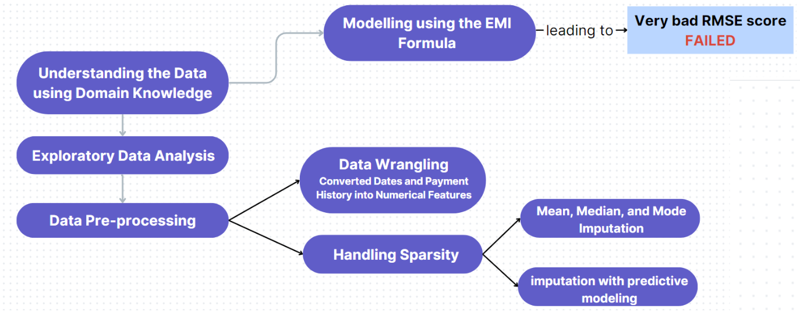
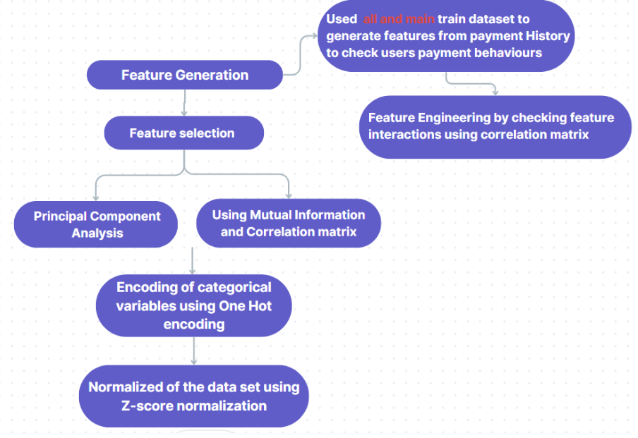
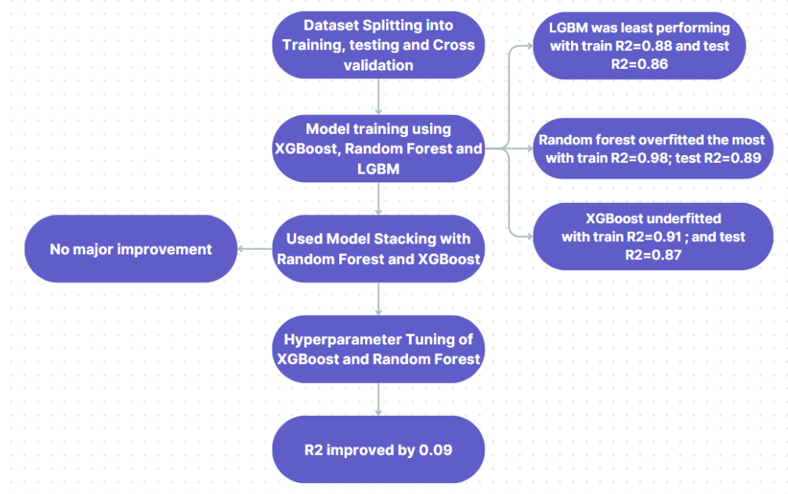

## Predicting Rate of Interest (ROI) from Bureau Data (Piramal Hackathon)
**Project Overview:**

As a leading finance firm, encountering data incompleteness is a common challenge for Piramal that impedes their ability to make conclusive decisions or predictions. One such scenario arises when determining the Rate of Interest (ROI) for an existing loan from a customer taken with an external Financial Institute. However, they do obtain other loan-related details for such tradelines by subscribing to bureaus such as CIBIL and Experian.

The challenge at hand involved using this data to accurately compute or be closest to the actual Rate of Interest (ROI) across various types of loans. Participants were encouraged to leverage mathematical equations in solving this problem while maximizing the available data. The final solution was expected to be robust enough to handle various loan types, including Housing Loan, Property Loan, Business Loan, and Personal Loan.'

**Task:**

We were expected to ideate on a scalable approach to the problem and to build a Machine Learning model, based on the data provided, that predicts the rate of interest(ROI) . 

**Dataset Details:**
<ul>
<li>train_main_loan.csv:  69958 x 24</li>
<li>train_all_loan.csv: 1066009 x 19</li>
<li>test_main_loan.csv: 29983 x 23</li>
<li>test_all_loan.csv: 452990 x 19</li>
</ul>
The data set consists of financial related data of a customer against a loan & also demographical data belonging to the same individual.

There are multiple files provided.
<ul>
<li>train_main_loan.csv : This will have the main loan on which the participant needs to build the model using the info pertaining to that loan along with Date Of Birth, Gender, Occupation type</li>

<li>test_main_loan.csv: Another file is provided with different set of IDs to validate your model. Once you are able to build model, then you are supposed to get predictions on this dataset using model fit from training dataset. This file would be split between PUBLIC and PRIVATE set on our side. Final evaluation would be done internally on PRIVATE dataset alone.

<li>There were other related files: train_all_loan.csv & test_all_loan.csv of train & test IDs respectively. These files contain customer’s complete credit history including other Live & Closed loans from the past. Participant can use this to extract more credit behavior of the customer and thereby in the model building part.</li>
</ul>

**MODELLING APPROACH**
<ul>
<li>EMI, Principal, intrest rate , and repayment Tenure can be easily related by this formula</li>
<li>This makes them very important features for predicting the ROI, despite a large fraction of them being missing</li>
<li>Tried estimating them using Predictive imputation techniques using the dataset where all the loans information was given.</li>
<li>Using Exploratory Data analysis and Feature Engineering came up with important features enchancing the predictive power of the machine Learning Model.</li>
<li>Used Tree based models that can capture non-linear realations between the dataset effectively like XGBoost, RandomForest and LGBM.</li>

</ul>

**1. DATA PRE-PROCESSING AND HANDLING MISSING VALUES**

**2. FEATURE ENGINEERING AND FEATURE SELECTION**

**3. MODEL TRAINING AND FINE-TUNING**

By addressing these steps and challenges, the project aims to develop a robust Machine Learning model capable of accurately predicting the Rate of Interest (ROI) from bureau data, thereby aiding in informed decision-making in the finance industry.
